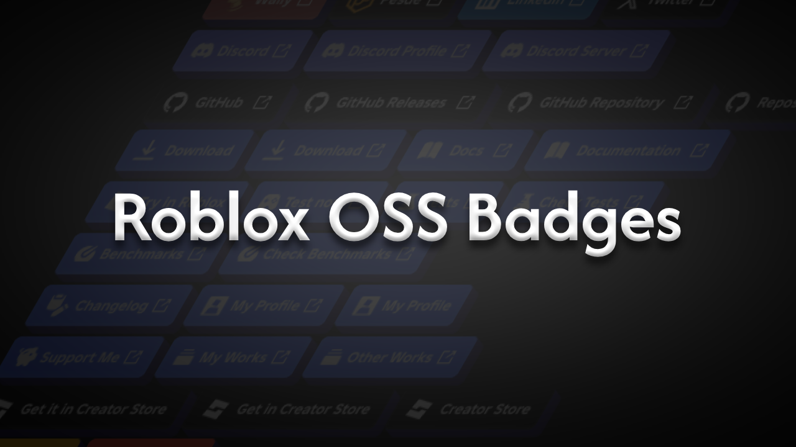
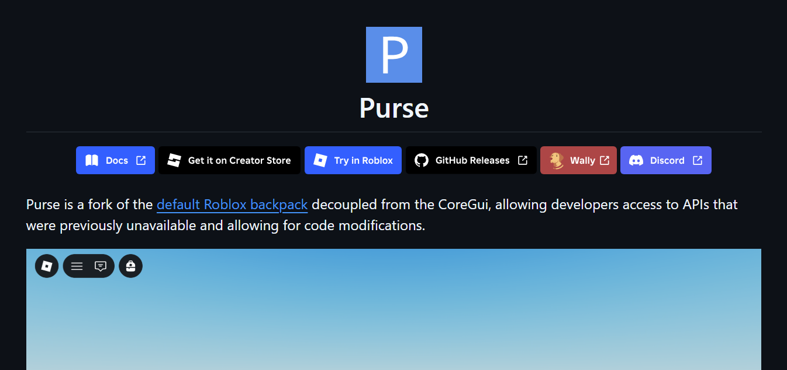
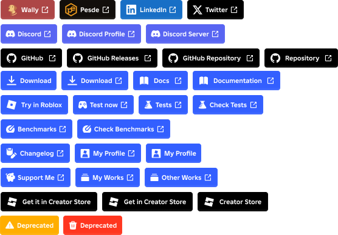

  

<h1 align="center">Roblox OSS Badges</h1>
Roblox-style badges for the Roblox Open Source Community. Beautiful, consistent badges for your Roblox (Luau) OSS projects

## Installation
[GitHub](https://github.com/maneetoo/Roblox-OSS-Badges/releases), [Figma](https://www.figma.com/design/vGXrazmoawtGBcMQD8aFI4/Roblox-OSS-Badges?node-id=0-1&t=Oh8gA84ToZcPrztt-1), [Gist](https://gist.github.com/maneetoo/41b5af208d3557260c790a53ef46ca43)

## Example Usage

  

## Overall Badges

  

The Idea was taken & approved by [RyanLua](https://github.com/ryanlua)

Made with ❤️ for the Roblox Open Source Community
