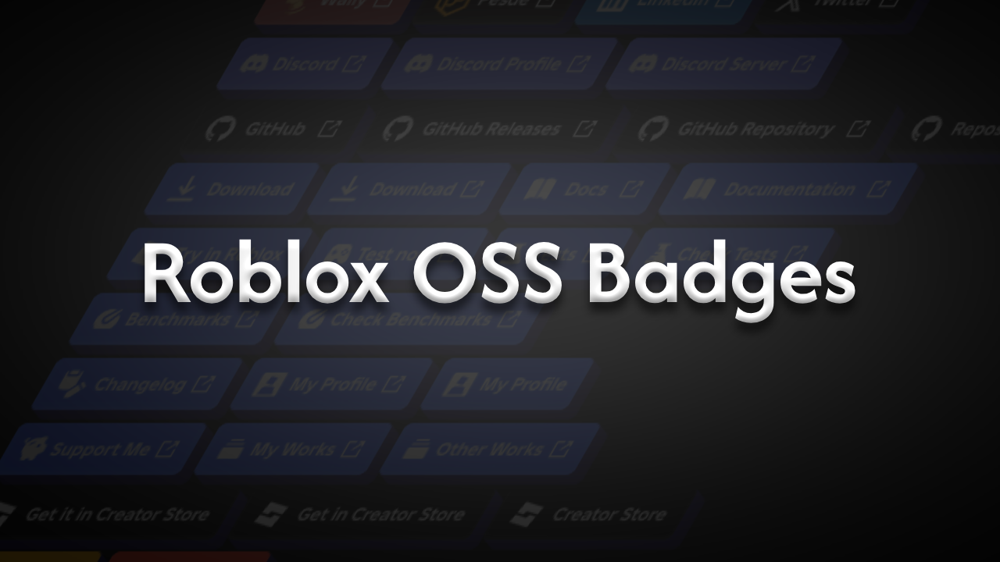
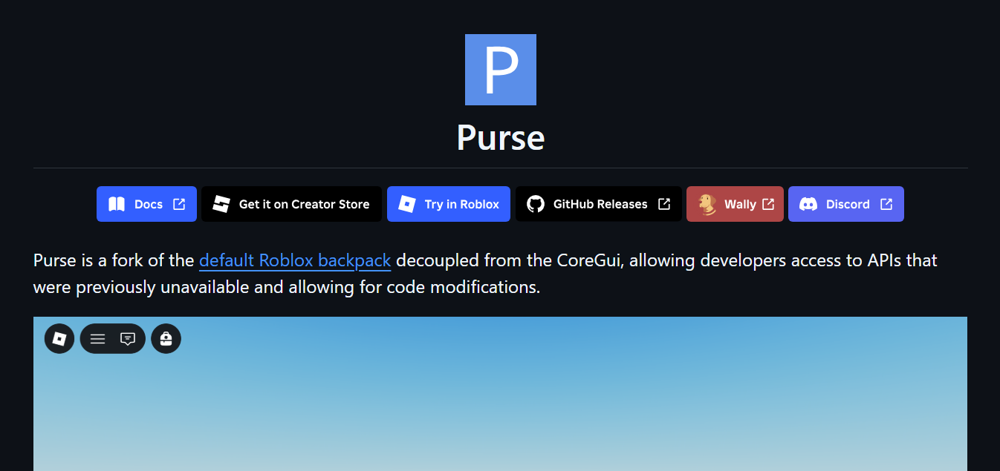
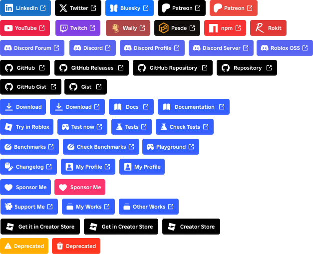

<div align="center">
  
</div>

<div align="center">
  
# [`🏅 Roblox OSS Badges`](https://devforum.roblox.com/t/roblox-oss-badges/4583909)

**Beautiful, consistent, and instantly recognizable badges designed in Roblox Style — for GitHub repositories, documentation sites, and project hubs. Perfect for Luau libraries, developer tooling, and Roblox OSS, but versatile enough for any project that wants a clean, cohesive look.**

</div>

<div align="center">

[](https://github.com/maneetoo/Roblox-OSS-Badges/releases)
[](https://discord.gg/vtUJdtUK2J)
[](https://discord.com/channels/385151591524597761/1494985067087269939)
[](https://github.com/maneetoo/Roblox-OSS-Badges/blob/main/CHANGELOG.md)
[](https://github.com/maneetoo/)

</div>

## Installation to your project

There are several ways to install Roblox OSS Badges, here are a few of them:

#### Figma:
1. Open [Figma Project](https://www.figma.com/design/vGXrazmoawtGBcMQD8aFI4/Roblox-OSS-Badges) of Roblox OSS Badges
2. Select the Badges you need/like in Figma Website/App
3. After you select it, a panel should appear on the right, scroll down to the `Export` section
4. Select the format, resolution, and download location you want, and click the `Export` button
5. Export Badges to your repository/gist or other holder

#### Manual Download:
1. Go to the [Releases Page](https://github.com/maneetoo/Roblox-OSS-Badges/releases) of this GitHub repository
2. Download the `Badges.zip` (or `.7z`, `.tar`) file from the latest release's assets
3. Select the badges you want and publish them using `Upload Files` in your GitHub Repositry/Roblox Forum

#### SVG:
1. Select the badge you need directly from this repository in the `Badges` folder
2. Click on this Badge, and a large preview window for the Badge should appear on the right
3. Right-click on the image and click `Copy Image Link`
4. In your repository `README.md`, add:
   ```md
   [](OPTIONAL-LINK-TO-EXTERNAL)
   ```

## Example Usage
<div align="center">
  
</div>

<div align="center">
  
### [[Link to Purse](https://devforum.roblox.com/t/purse-coregui-decoupled-default-backpack/4040755)], [[Link to Studio Activity](https://github.com/BrookenRecord/studio-activity)]

</div>

## Overall Badges
<div align="center">
  
</div>


## Mentions
The Idea was taken & approved by [RyanLua](https://github.com/ryanlua)

Made with ❤️ for the Roblox Open Source Community

## License
Roblox OSS Badges is under [MIT License](https://github.com/maneetoo/Roblox-OSS-Badges/blob/main/LICENSE)
